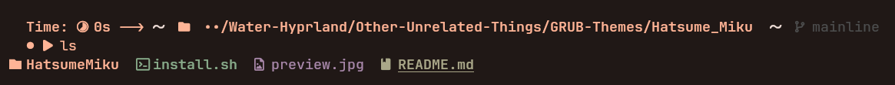
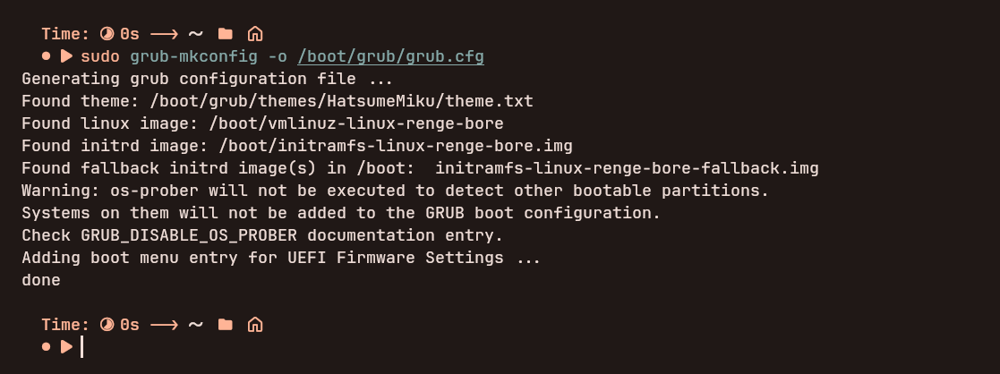

**Changing** the ``GRUB`` menu interface is quite easy on **RengeOS**, **This method** might be quite different from **other distributions** because
the default ``GRUB`` themes folder will always be ``/boot/grub/themes/``
instead of ``/usr/share/grub/themes/`` as **it doesn't** detect grub themes located there and **please** note that this is a **manual guide**.

## Prepare

- **First**, you need to find the grub theme you like anywhere, here I will use <a href="" target="_blank" rel="noopener noreferrer">Miku GRUB Themes</a> (credit: **Nguyễn Văn Phan**) as the **installation target** as a **theme** for ``GRUB``.

+ **I** have the following folder structure:



+ **Inside** the ``HatsumeMiku`` folder there is a ``themes.txt`` file so it is the grub themes folder I want to install for ``GRUB`` menu

## Start applying GRUB theme

+ **First** we will ``cp`` (copy) that **theme folder** into ``/boot/grub/themes/``

```sh
sudo cp -r ./HatsumeMiku/ /boot/grub/themes/
```

+ **Now** we need to **edit** the content inside ``/etc/default/grub`` so that ``GRUB`` can know where the **theme path** we need to **apply** is

```sh
# you can change the editor you want instead of ``nano``
sudo nano /etc/default/grub
```
+ **Then** add this line at the end of the file content as follows:

+ **Don't forget** change the path below to the path to your theme then **exit** and **save** the file.

```sh
# If it exists, uncomment it or delete it and replace it with this
GRUB_THEME="/boot/grub/themes/HatsumeMiku/theme.txt"
```

+ **The final step** we need to refresh GRUB's config

```sh
sudo grub-mkconfig -o /boot/grub/grub.cfg
```



+ **Now** everything is done, **reboot the system** and enjoy your ``GRUB`` Theme:)
