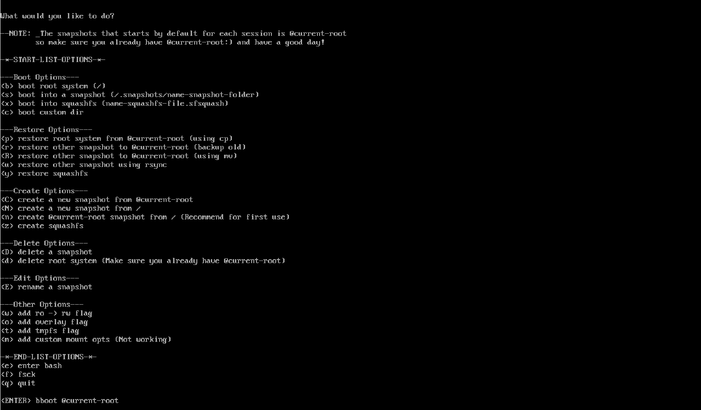

**Bcachefs** is basically quite similar to the Btrfs we know, and if you want to learn more about it,
you can read here: <a href="https://bcachefs.org/" target="_blank" rel="noopener noreferrer">Bcachefs Filesystem</a>

<br />

**Currently**, there's no clear explanation online for how to take snapshots of the / directory system in bcachefs,
so we can now enable snapshots for bcachefs by running the `bcachefs-rollback` hook of mkinitcpio for initramfs.
<br />
**Thanks** to [**@bathtime**](https://github.com/bathtime) for coming up with this method ❤️

## Let's proceed
<br />

import { Aside } from '@astrojs/starlight/components';

<Aside type="caution" title="Watch out!">
  **Currently**, this method is used daily by the owner on their personal computer,
  but there is no guarantee that it will not cause any problems in the future,
  and since it is not a common method, use it at **your own risk!**
</Aside>

**First**, we need to ``git clone`` this source before proceeding.

```sh
cd /tmp/ && git clone https://github.com/RengeOS/Bcachefs-Rollback-Initramfs
```

<Aside type="danger">
  **Do not** modify hooks inside the source code if you do not understand how they work, as this could lead to **Kernel Panic!**
</Aside>

**Next**, we will install it by building it from source code with ``makepkg -si``.

```sh
cd Bcachefs-Rollback-Initramfs/ && makepkg -si
```
**After** the package build and installation process is successful, our task is to restart the entire system.

```sh
# you can replace reboot to 'systemctl reboot' if not working
reboot
```

## How to use Bacachefs Rollback

- **After** restarting following the first time you **enable** ``Bacachefs Rollback``, you will encounter something like this.



- **Now**, the first thing you need to do is press [**n**] to create ``@current-root`` based on your ``/`` and located in the ``/.snapshots`` directory.
- **Next**, press the [**enter**] button to boot into the ``@current-root`` you created earlier, and I will explain about ``Bcachefs Rollback`` later.

## Options in Bacachefs Rollback

(Coming Soon!)
