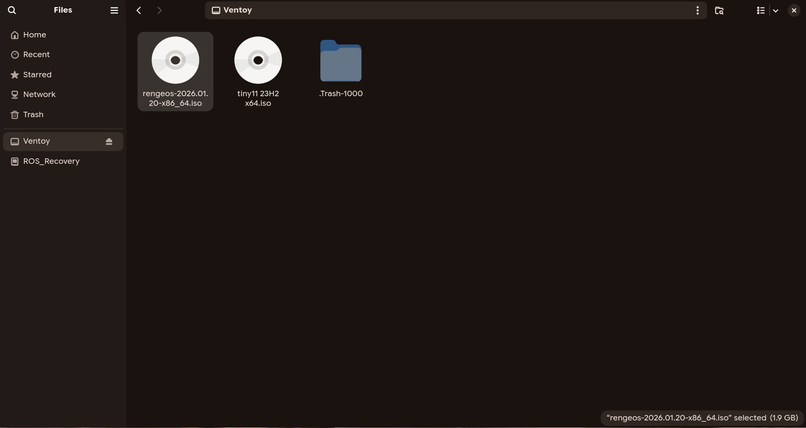

**Once** we have the ISO file, the next step is to **flash** the ISO image onto a USB stick to make it bootable. Follow the **instructions** below:

import { Tabs, TabItem } from '@astrojs/starlight/components';

## Methods
<Tabs>
  <TabItem label="Ventoy (recommend)">
  - **Ventoy** is an open source tool to create bootable USB drive for ISO/WIM/IMG/VHD(x)/EFI files. <br />
  - With **Ventoy**, you don't need to format the disk over and over, you just need to copy the ISO/WIM/IMG/VHD(x)/EFI files to the USB drive and boot them directly. <br />
  + First, follow the instructions here: <a href="https://www.ventoy.net/en/doc_start.html" target="_blank" rel="noopener noreferrer">How to make bootable USB drive with Ventoy</a>
  + Next, we will copy and paste the ISO file into the **Ventoy** folder like this: <br />
  
  + **Once everything is done**, we will remove the USB drive, and now you have a bootable USB drive to install **RengeOS**, which supports both **UEFI and Legacy BIOS modes**.

  </TabItem>
  <TabItem label="dd command">
  - If you're already using Linux, you can create an RengeOS bootable USB with dd. dd creates both BIOS and UEFI bootable USB  Follow the steps below to create a bootable USB with dd :
  + Open a terminal and run ``lsblk`` to get the USB info. In my case, it's /dev/sda.
  
  ```sh
[rengeos@host ~]$ lsblk

NAME        MAJ:MIN RM   SIZE RO TYPE MOUNTPOINTS
sda           8:0    1  14.7G  0 disk 
├─sda1        8:1    1  14.6G  0 part 
└─sda2        8:2    1    32M  0 part 
zram0       253:0    0   2.8G  0 disk [SWAP]
nvme0n1     259:0    0 238.5G  0 disk 
...
  ```
  + After finding your USB device, Run dd to flash the ISO on USB.
  
  ```sh
  sudo dd bs=4M if=path/to/rengeos.iso of=/dev/sdX status=progress oflag=sync
  ```
  + Make sure you replace path/to/rengeos.iso with the RengeOS ISO path and sdX with your USB device.
  + This will create a bootable RengeOS USB for both BIOS and UEFI.

  
  </TabItem>
  <TabItem label="Popsicle (coming soon!)">
  </TabItem>
</Tabs>
