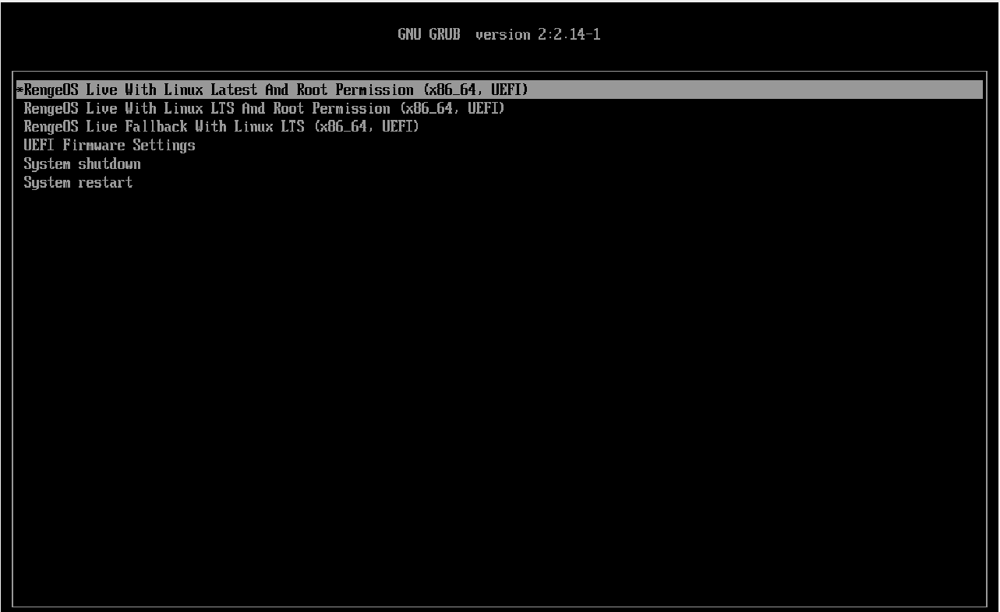
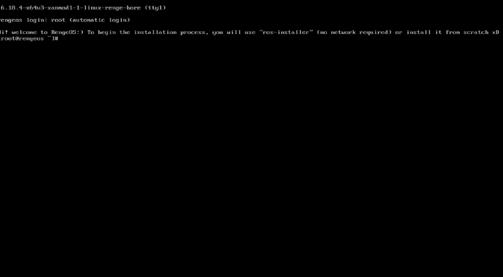
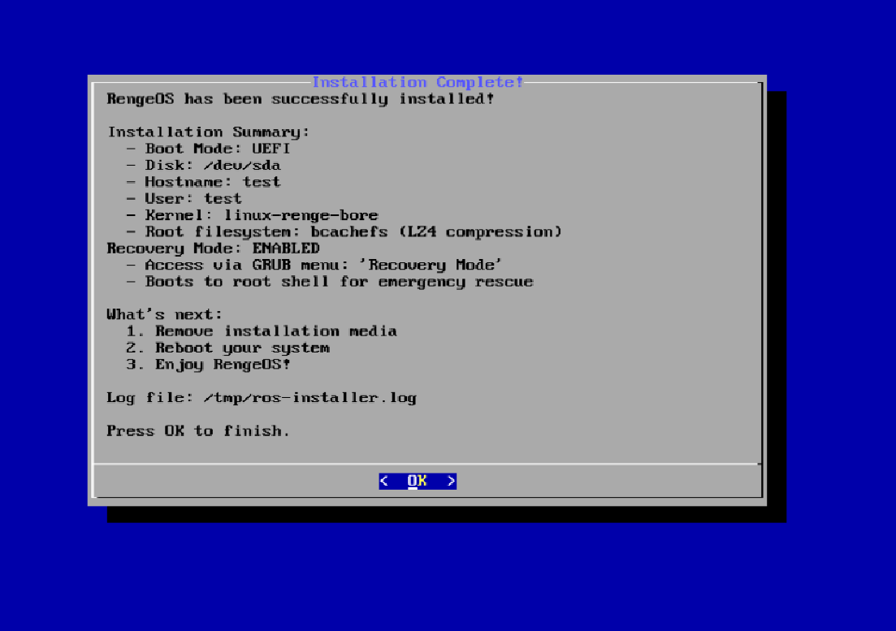

**Essentially**, we'll use ros-installer to automate the installation process from a Live ISO to the machine using the ``unsquashfs`` method and some other related techniques during the process.

import { Aside } from '@astrojs/starlight/components';

<Aside type="note">
  **Currently**, only offline installation is supported,
  and there are no plans to switch the installation process to online for the following reasons:
+ **Online installation** can be quite risky if the network encounters problems during the installation process,
  such as installing a package, as restarting the process would be very inconvenient.
+ The **online installation** process is not compatible with the original design of this distribution (RengeOS).
+ Maintaining **other packages** and **infrastructure** using online methods would be quite expensive for me :(
</Aside>

## Boot into Live ISO
- First, we need to plug in the bootable USB drive containing the ISO file.
  Then, depending on your computer's hardware manufacturer,
  access the boot menu and boot from that USB drive.

- Then you will see the boot menu will look like this (UEFI). For Legacy BIOS, it will display similarly but with a slightly different interface.



<Aside type="tip">
  If you don't know what to choose, just select Linux Latest.
</Aside>

<Aside type="caution" title="Note">
If you encounter a black screen error when selecting Linux Latest on Intel 10th generation chips (reported black screen issues), try selecting Linux LTS.
</Aside>

## Start the installation process
- After the systemd process is complete, you will see a screen like this (RengeOS is inherently a minimal distribution).



- Next, we will need to begin the installation process with ``ros-installer``

```sh
ros-installer
```
- Immediately after you run the installer, this interface will appear on the screen. (temporary image)


